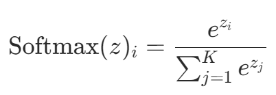
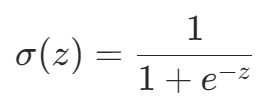
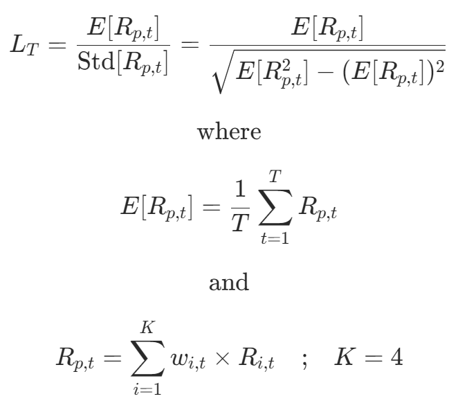
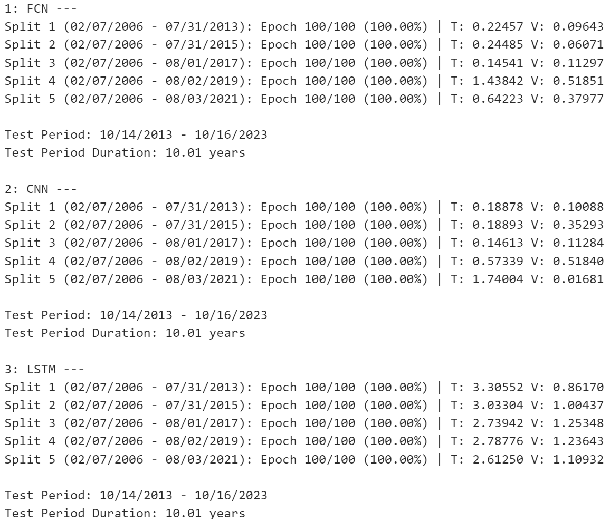
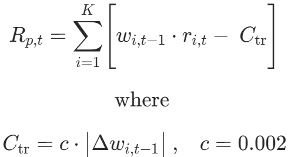
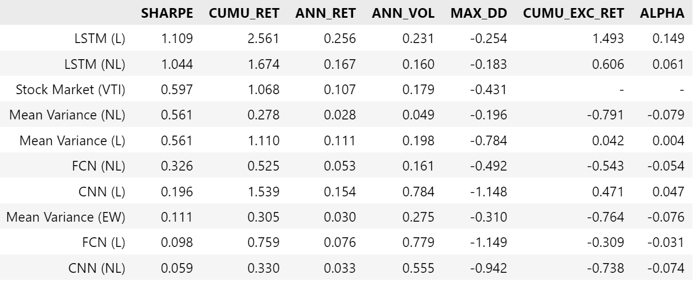

# Portfolio Optimization via Deep Learning

Aung Si<br>
October 21<sup>st</sup>, 2023

---

## Contents
- [1. Overview](#1-overview)
- [2. The Staticity of Mean Variance Optimization](#2-the-staticity-of-mean-variance-optimization)
- [3. Methodology & Data](#3-methodology--data)
    - [3.1. Feature Engineering](#31-feature-engineering)
    - [3.2. Sidestepping Price / Return Forecasting](#32-sidestepping-price--return-forecasting)
    - [3.3. Data Sources](#33-data-sources)
    - [3.4. Temporal Considerations](#34-temporal-considerations)
- [4. Modeling](#4-modeling)
    - [4.1 Leveraged vs Non-leveraged Scenarios](#41-leveraged-vs-non-leveraged-scenarios)
    - [4.2 Activation Functions: Sigmoid vs Softmax](#42-activation-functions-sigmoid-vs-softmax)
        - [4.2.1 Softmax](#421-softmax)
        - [4.2.2 Sigmoid](#422-sigmoid)
        - [4.2.3 Interpreting Probabilities as Portfolio Allocations](#423-interpreting-probabilities-as-portfolio-allocations)
        - [4.2.4 Leverage Factor](#424-leverage-factor)
    - [4.3 Model Architectures, Inputs, Targets, and Outputs](#43-model-architectures-inputs-targets-and-outputs)
    - [4.4 Objective Function](#44-objective-function)
    - [4.5 Training Scheme](#45-training-scheme)
- [5. Results](#5-results)
    - [5.1 Training and Validation](#51-training-and-validation)
    - [5.2 Performance of Models Over Time](#52-performance-of-models-over-time)
    - [5.3 Portfolio Metrics](#53-portfolio-metrics)
    - [5.4 Performance During the COVID-19 Downturn](#54-performance-during-the-covid-19-downturn)
- [6. Conclusion](#6-conclusion)
- [7. Limitations](#7-limitations)
- [8. Future Work](#8-future-work)
- [9. Repository Structure](#9-repository-structure)

## 1. Overview

*This endeavor draws substantive influence from the University of Oxford's [Deep Learning for Portfolio Optimization](https://arxiv.org/pdf/2005.13665.pdf). However, the project diverges at crucial junctures in its execution.*

The original paper, written by Zihao Zhang, Stefan Zohren, and Stephen Roberts, introduces a novel approach to portfolio optimization by employing neural networks. Unlike traditional mean-variance methods, which are inherently static and rely on historical data, the paper's approach uses the Sharpe ratio as the objective function (maximized via gradient ascent) to adaptively optimize portfolio allocations. This creates a more dynamic, forward-looking model capable of adjusting to market conditions. While the authors tested various models such as FCN, CNN, and LSTM using a long-only strategy without leverage, my exploration included both with and without leverage approaches. The critical distinction lies in the application of sigmoid and softmax functions.

Another noteworthy divergence is in volatility scaling: while the authors applied it, I opted against its implementation for the sake of concision. It should be noted here that volatility scaling inherently employs leverage, so in some sense, the weights output by the sigmoid model that I employed share some similarities with the authors' volatility-scaled allocations. Despite the differences, I corroborated their conclusion that the LSTM model exhibited the most adaptability and consistently superior performance. Specifically, in my rendition, the leveraged LSTM model surpassed the VTI index by 149.3%, boasting an impressive Sharpe ratio of 1.109 versus VTI's 0.597 over a decade-long backtesting period. Conversely, the non-leveraged LSTM model yielded a 60.6% advantage over the VTI and recorded a Sharpe ratio of 1.044 against VTI's 0.597.

A salient characteristic of the sigmoid function, especially pertinent to my leveraged model, is its behavior. On certain dates, it results in leveraging, while on others, not all available capital is deployed. This variability speaks to the model's adaptability to market dynamics, optimizing capital utilization based on prevailing conditions.

All implementations of neural networks in this project were carried out with [`PyTorch`](https://pytorch.org).

## 2. The Staticity of Mean Variance Optimization

Traditional portfolio optimization has long been dominated by the [Mean Variance Optimization (MVO)](https://www.math.hkust.edu.hk/~maykwok/courses/ma362/07F/markowitz_JF.pdf) method, introduced by Harry Markowitz in 1952. While this method is grounded in elegant mathematics and provides a pragmatic foundation for portfolio selection, it exhibits notable shortcomings.

MVO hinges on the assumption that asset returns are normally distributed, and it primarily focuses on two parameters: expected returns and the covariance matrix of returns. By optimizing these, MVO determines the best possible asset allocation that will yield the highest expected return for a given level of risk.

However, the static nature of MVO emerges from its reliance on historical data to gauge future asset performances. By design, it takes a retrospective stance, relying on past return distributions to craft future portfolio allocations. This backward-looking approach intrinsically limits its adaptability to evolving market conditions and new information sets.

Moreover, the assumptions of MVO become especially questionable during tumultuous market periods. Black swan events, such as financial crises, can skew return distributions away from normality, leading to estimation errors in MVO's output. Additionally, the challenge of accurately estimating expected returns amplifies the potential pitfalls of the MVO. Often, slight changes in expected return estimations can result in substantially different portfolio compositions, creating inconsistency and unpredictability. MVO is also deterministic in its nature, which can lead to extreme portfolio weights. Without constraints, it might recommend full allocation to a singular asset if historical data suggests superior returns, disregarding diversification principles.

In light of these limitations, the quest for a more dynamic, adaptive, and forward-looking portfolio optimization technique becomes paramount. As the financial industry evolves, the inclusion of machine learning and neural networks offers a promising avenue to address the staticity inherent in MVO, laying the groundwork for the methodologies explored in subsequent sections of this study.

## 3. Methodology & Data

The methodology underpinning this study aligns closely with the framework presented in the original paper. Both our approaches center on the use of asset prices and returns as input features. I follow the below structure.

1. Retrieve market index data (VTI, DBC, AGG, and VIX) and compute logarithmic daily returns.
2. Conduct walk-forward portfolio optimization via neural networks (leveraged and non-leveraged).
3. Conduct a backtest for both scenarios, ***accounting for both transaction costs, borrowing costs, and principal ammortization***.
5. Examine allocations at specific timeframes (namely the COVID-19 pandemic) and overall adaptability of allocations with respect to the price trajectories of each index.
6. Examine the usage of leverage over time of each model.

While I maintain the core principles of the original paper, the key divergenceS lie in the dates I use for the data and in my usage of the sigmoid function, and which I will explore later.

### 3.1 Feature Engineering
The sole features employed are the asset prices and returns. This parsimony in feature selection helps mitigate the risk of overfitting, which may help to ensure the models remain robust and generalize well across different market conditions. However, the authors note the inherent potential for feature redundancy, given that returns are inherently derived from prices. Their inclusion hinges on their role in computing overall backtest returns. 

### 3.2 Sidestepping Price / Return Forecasting
While traditional methods often require a forecast of future returns or prices, this approach obviates that need. Given the inherent unpredictability, near-randomness, and self-correcting nature of the stock market, attempting to forecast returns frequently results in limited practical insights and can introduce unnecessary noise (though it does work in some cases, as evident in a [previous project I've worked on](https://github.com/aungsias/Eigen/tree/main/DynamicAssetManagement).)

Instead, the innovation brought forth by the authors, and mirrored in this study, is the direct translation of this information into optimal portfolio weights. This is achieved using neural networks, specifically through the activation functions which are central to our model differentiation: **sigmoid** (where outputs range from 0 to 1) for leveraged models and **softmax** (where outputs range from 0 to 1 sum up to 1) for non-leveraged ones.

### 3.3 Data Sources
All data for this project were retrieved via [`yfinance`](https://pypi.org/project/yfinance/). Both the original study and this research use the same four indices as primary data sources:

- **VTI (Vanguard Total Stock Market Index Fund ETF)**: A proxy for the overall stock market.
- **DBC (Invesco DB Commodity Index Tracking Fund)**: Represents the commodities market.
- **AGG (iShares Core US Aggregate Bond ETF)**: Captures the bond market dynamics.
- **VIX (Chicago Board Options Exchange's CBOE Volatility Index)**: Provides insights into the overall market volatility.

Each of these indices is distinct and serves as an effective representative for different market characteristics, ensuring a multipronged view of the financial landscape. The authors' data range from 2006 - 2020, and their testing period is from 2011 - 2020, while the data I use range from 2006 - 2023, and the testing period I employ is from 2013 - 2023.

### 3.4 Temporal Considerations
Given that this study uses adjusted closing prices, there exists an inherent information lag. To account for this, the output allocations are lagged by a day, ensuring the methodology respects the chronological nature of information flow in financial markets.

## 4. Modeling

All models were compared against a simple equal-weight portfolio and a baseline mean-variance (maximum Sharpe) portfolio.

### 4.1 Leveraged vs Non-leveraged Scenarios
Before delving into the models, it's imperative to differentiate between leveraged and non-leveraged scenarios:

Leveraged Scenario: Allows borrowing of funds to amplify potential returns on an investment. However, while this offers the potential for magnified profits, it also brings an increased risk of losses.

Non-leveraged Scenario: The more orthodox investment approach, where no borrowing is involved. The potential for returns is directly tied to the initial investment amount, with no amplification. The risk is ostensibly lower compared to the leveraged scenario.

From an architectural perspective, the differentiation between these scenarios is encapsulated in the model's output layer. In a non-leveraged setting, a softmax layer ensures portfolio allocations sum to 1. In contrast, the leveraged scenario employs a sigmoid layer, offering a more flexible allocation scheme where both borrowed and invested funds can be modeled.

### 4.2 Activation Functions: Sigmoid vs Softmax
Understanding the mathematical properties of activation functions is paramount when discerning their suitability for specific tasks, particularly in portfolio management.

#### 4.2.1 Softmax

The Softmax function for a given vector $z$ is defined as:

<p align="center">
    
</p>

Where $K$ is the number of classes (or assets in the context of portfolio allocation). The output is a probability distribution over $K$ classes, meaning the sum of the outputs is exactly 1. This is suitable for non-leveraged portfolio allocations where the sum of asset allocations must equal the total investment.

The Softmax function ensures that an increase in the allocation of one asset leads to a corresponding decrease in the allocation of at least one other asset. This is coherent with the non-leveraged scenario, where any increase in one asset's allocation must be offset by reducing others to maintain the total investment constant.

#### 4.2.2 Sigmoid

<p align="center">
    
</p>

The sigmoid function ranges between 0 and 1, and it effectively squashes its input into this interval. This makes it apt for representing probabilities or portfolio allocations when considering leveraged scenarios. A value close to 1 can represent a high allocation to a particular asset, while a value close to 0 can indicate minimal or no allocation.

However, the sigmoid function treats each output independently, meaning that the sum of the outputs is not constrained to be 1. In a leveraged scenario, this flexibility is advantageous, allowing the sum of allocations to be greater than the initial investment (representing borrowing) or less than the initial investment (indicating holding cash).

#### 4.2.3 Interpreting Probabilities as Portfolio Allocations

The beauty of using these activation functions in portfolio management lies in their ability to transmute raw model outputs into interpretable portfolio allocations. Both sigmoid and softmax render outputs that align with the structure of probability distributions. Within the investment milieu, such probabilities are construed as the proportionate allocations of a portfolio to varying assets. For instance, should an asset procure a probability (or output) of 0.2 from the model, it signifies a recommendation that 20% of the portfolio be assigned to that particular asset. However, neural networks are domain agnostic and don't possess inherent financial cognizance. Its outputs, derived from patterns in the training data, are interpreted in this case by financial experts in the context of asset allocations. The network's main goal aligns with the training objective function (explored in section [4.4](#44-objective-function)), and the specific allocations are but a means to achieve that end. Thus, while the model might not fathom the intricacies of finance, its outputs, when correctly interpreted, can seamlessly integrate into portfolio management.

#### 4.2.4 Leverage Factor

In the non-leveraged approach, softmax normalization ensures that asset allocations sum to 1, effectively capping total portfolio exposure at 100%. In contrast, the leveraged model employs a sigmoid function for each asset, allowing individual allocations to reach up to 1. Consequently, the portfolio's total exposure can amplify to a maximum of 400%, or four times the available capital, when accounting for all four market indices.

### 4.3 Model Architectures, Inputs, Targets, and Outputs

The feature set includes 4 assets (number of indices) and 8 features (4 price series + 4 returns series), a lookback period of 50 days, and a total of 4403 samples (4453 data points - 50 day lookback period). All targets take the form $(4403,\text{ }4)$, representing the daily returns of each market index beyond the first 50 days.

1. **1D Convolutional Neural Network (CNN)**: This model deploys 1D convolutional layers for feature extraction. After the convolution, a dynamic fully connected layer transforms the output for portfolio allocations, which are then passed through a sigmoid activation function (for leverage) or a softmax activation function (no leverage) to ensure values between 0 and 1. `Pytorch`'s `Conv1d` takes an input shape of $(\text{n. samples, n. features, sequence length})$, so for our dataset it would have the shape $(4403,\text{ }8,\text{ }50)$.

2. **Fully Connected Neural Network (FCN)**: Being a more traditional architecture, it relies on two dense layers for processing. The final layer's outputs represent portfolio allocations, post sigmoid / softmax activation, ensuring values remain in the [0, 1] interval. I constructed the FCN via `PyTorch`'s `Linear` layers, which take inputs of size $(\text{n. samples}, \text{ sequence length} \times \text{n. features})$, so for our dataset it would have the shape $(4403,\text{ }50 \times 8)$ or $(4403,\text{ }400)$.

3. **Long Short-Term Memory (LSTM)**: Leveraging the prowess of LSTM  units, this model is designed to recognize temporal patterns in data sequences. The LSTM layer processes sequences, and its outputs are directed to a fully connected layer. The final portfolio allocations, as in other leveraged models, are determined post a sigmoid / softmax activation. `PyTorch`'s `LSTM` class accepts an input of shape $(\text{n. samples, sequence length, n. features})$, so for our dataset it would have the shape $(4403,\text{ }50,\text{ }8)$.

The crux of the optimization problem resides in the above models' output layer, which output 4 allocation values (or portfolio weights), one for each asset. Feel free to peruse the [`no_leverage_models`](workflow/tools/no_leverage_models) and [`leverage_models`](workflow/tools/leverage_models) modules to see the source code for each model and its architecture.

### 4.4 Objective Function

The objective function used to train each model is the key innovation brought forth by the authors of the original paper. Instead of traditional loss functions such as Mean Squared Error (MSE) and the like, each model is trained to maximize the Sharpe ratio per trading period (1 day):

<p align="center">
    
</p>

$R_{p,t}$ is the return of the portfolio at time $t$, taken as the sum product of the allocation at time $t$ determined by the model of each asset $i$ and the asset's actual logarithmic return at time $t$. The expected portfolio return, ${E[R_{p,t}]}$ is taken as the mean of the returns within the batch.

By default, the models follow gradient descent, but we intend to maximize the Sharpe ratio via gradient *ascent*,

<p align="center">
    
</p>

so in the code, the objective function is written to return a negative value.* View the [`metrics`](workflow/tools/metrics.py) module to see the implementation of the objective function in code.

**Note that `PyTorch`'s Adam optimizer now permits a `maximize` parameter so as to eliminate the need to create negative objective functions. However, for the sake of illustration I adhere to the default parameter.*

### 4.5 Training Scheme

The models are retrained every two years, using all data available up until that point. A hidden dimension size of 64 is used, as per the authors' configuration. A validation size of 20% is used, and each testing period spans 504 days (2 years of trading days). Every model is trained over 100 epochs at each split.

## 5. Results

### 5.1 Training and Validation

#### 5.1.1 No-leverage Models

<p align="center">
    
    <br>
</p>

In the FCN and CNN architectures, there's a noticeable disparity between training (T) and validation (V) outcomes. For instance, the FCN model's first split shows T: 0.95816 and V: 0.20811. This stark contrast suggests overfitting. The LSTM model also shows consistent overfitting, although its validation Sharpe ratios are positive and seem realistic. Overall, there is no conspicuous evidence of underfitting. Most training results are robust. Validation results oscillate for the FCN model; the third split even presents a negative Sharpe ratio, which isn't ideal. For the CNN, we see a mix of positive and negative Sharpe ratios. The negative Sharpe ratio in the second and fifth splits denotes potential adversarial periods or model instability. In sum, the LSTM shows consistently positive validation, suggesting it handles the time series data more adeptly. The FCN and CNN models, despite their prowess on training data, show potential overfitting signs given their variable validation results. The LSTM by far showcases he most consistent validation performance, suggesting its suitability for the dataset's temporal nature.

**Leveraged Models:**

<p align="center">
    
    <br>
</p>

For the FCN architecture, disparity between training (T) and validation (V) persists. Notably, the third split suggests the model has learned the training set intricacies but falters on unseen data, indicative of overfitting. The fluctuation in validation result are especially pronounced in the fourth split, suggesting an overfit model. The model's variability in validation makes it unideal. The CNN model behaves similarly. For instance, the first split with T: 0.18878 and V: 0.10088 showcases the potential overfitting scenario. The validation outcomes, with their alternating positive and negative Sharpe ratios, hint at periods where the model either thrived or faltered. Particularly, the fifth split (T: 1.74004, V: 0.01681) highlights a potentially adversarial period or a lapse in model robustness. The LSTM once again seems most promising. While overfitting is still palpable, the validation outcomes are predominantly positive, echoing the model's aptitude.

### 5.2 Backtest

- **Transaction costs:** Transaction costs are accounted for by incorporating a cost term into the portfolio return equation. Specifically, these costs are a function of the change in asset weights ($\Delta{w_{i,t}}$) between two consecutive time periods. A cost coefficient ($c$), set at 0.2%, is multiplied by this change to calculate the total cost. This cost is then subtracted from the gross returns of the portfolio, resulting in a net return that reflects the impact of transaction costs on portfolio performance:

<p align="center">
    
</p>

- **Borrowing Costs and Amortization:** For the leveraged models, we need to account for borrowoing costs and principal amortization. Borrowing costs ($C_{\text{bo}}$) are calculated daily, utilizing the change in leverage ($\Delta{L_{i,t}}$). $L$ is the sum of the portfolio weights in excess of 1, or allocations exceeding the available capital. The daily interest rate, derived from an annual rate of 5%, is applied to the change in leverage. Amortization of principal ($P$) is also accounted for, computed using a daily amortization rate ($A$) based on a 2-year repayment term. These costs, along with the transaction costs, are subtracted from the gross portfolio returns to give us the net portfolio returns:

<p align="center">
    
</p>

Net costs, we have:

<p align="center">
    
    <br>
    <i>Figure 1: Equity Curves vs. VTI, Cumulative Logarithmic Return</i>
</p>

In assessing the models over time, the leveraged LSTM model conspicuously stands out with its stellar performance, markedly surpassing its no-leverage counterpart and the broader stock market epitomized by VTI. Such dominance accentuates its adeptness at capturing market trends, capitalizing often antithetical market trends, and overall its prowess in return generation. In juxtaposition, the Mean Variance models, irrespective of whether they deploy leverage or not, tread similar paths, indicating a degree of consistency. Yet, they remain eclipsed by the superior performance of the LSTM models.

Conversely, the FCN and CNN models, both with and without the leverage mechanism, seem to grapple in keeping pace, lagging discernibly behind their LSTM and Mean Variance counterparts.

#### 5.3 Portfolio Metrics

<p align="center">
    
</p>

- **Sharpe Ratio**: The leveraged LSTM model yields the highest Sharpe ratio at **1.109**, signifying optimal risk-adjusted returns. This is closely trailed by the no-leverage LSTM model at **1.044**. The stock market's Sharpe ratio stands at **0.597**, with most models, except for the CNN and FCN variants, surpassing this benchmark.

- **Cumulative Returns**: Once again, the leveraged LSTM model reigns supreme with a return of **2.561**. Notably, its non-leveraged counterpart produces a return of **1.674**, underscoring the benefit of leverage in enhancing returns.

- **Annual Volatility**: The leveraged CNN model exhibits the highest volatility at **0.784**, indicative of higher risk. In contrast, the leveraged Mean Variance model manifests the lowest volatility, making it the most stable among the lot.

- **Maximum Drawdown**: All models and the stock market have experienced negative drawdowns. The leveraged CNN model faced the steepest decline with a drawdown of **-1.148**, highlighting potential vulnerabilities.

- **Alpha**: The leveraged LSTM model boasts the highest alpha value at **0.149**, suggesting its ability to generate excess returns compared to the stock market. Most models display positive alpha values, except for the CNN and FCN models without leverage and the Mean Variance models.

In summation, the LSTM models, especially when leveraged, emerge as the most efficacious in this assessment, outpacing other models and the stock market. However, the feasibility of the leveraged models come down to the risk appetite of the investor, given the inherent risks associated with leveraging.

#### 5.4 Performance During the COVID-19 Downturn

As did the authors of the original paper, we can go further in our analysis and see the allocations that led to the stellar performance within each LSTM model. To do this we'll examine the allocations at the COVID-19 downturn, taking place in the first quarter of 2020.

**No-leverage LSTM:**

<p align="center">
    
    <br>
    <i>Figure 2: No-Leverage LSTM Allocations, Q1 2020</i>
</p>

- **Bonds**: Bond allocation in this variant exhibits a distinct trend. Unlike its leveraged counterpart, the no-leverage LSTM exhibits a steeper incline in bond allocations starting early in the quarter, positioning defensively well before the pronounced upheaval. This sugggests an innate aversion to undue risks.
- **Commodities**: The model's commodities strategy showcases cautious oscillation. Instead of the pronounced flux observed in the Leveraged model, here the allocations are restrained, which is more circumspect in nature.
- **Stocks**: The model mitigated exposures to stocks and instead loaded up on bonds during the late February to mid-March window, around when the stock market crash began. It began to increase its stock holdings thereafter once, in time for the bull market that followed.
- **Volatility**: In the face of burgeoning volatility, the model minimized its volatility allocations when volatility surges are anticipated, revealing its conservative stance.

**Leveraged LSTM:**

<p align="center">
    
    <br>
    <i>Figure 3: Leveraged LSTM Allocations, Q1 2020</i>
</p>

***Figure 3*** demarcates the astuteness of the LSTM model's asset allocation acumen amidst the turbulent outset of 2020:

- **Bonds**: While bond prices demonstrated moderate volatility, the LSTM model maintains a stable allocation in bonds, predominantly oscillating between 86% to 89%. A notable spike in bond allocation circa March aligns with a temporary ascent in bond prices, hinting at both the model's ability to capitalize on upward price movements and its repositioning toward safer instruments prior to a stark downturn.
- **Commodities**: The allocation for commodities undergoes pronounced flux as commodity prices oscillate with broader amplitude; the model's allocations seem to somewaht mirror these shifts.
- **Stocks**: The model seems to have anticipated the impending crash starting March, where it reduced stock allocations from approximately 80% to just over 65%.
- **Volatility**: Even as volatility prices soar dramatically mid-quarter, the LSTM model contracts its allocation, reflecting its anticipatory stance to sidestep the ensuing volatility surge.

### 6. Conclusion

This project set out to ascertain the efficacy of neural networks in optimizing financial portfolios, contrasting the results against traditional Mean Variance Optimization (MVO). The foray shed light on the utility and dynamic advantages of using neural networks, specifically LSTM models, over their static MVO counterparts. The FCN and CNN architectures showed signs of overfitting, evidenced by the disparity between training and validation Sharpe ratios. This compromises their generalizability to unseen data and hence their utility in real-world applications. Both the leveraged and non-leveraged LSTM models, on the other hand displayed robust performance, outstripping the other models and the broader stock market in terms of Sharpe ratio and cumulative returns.

- **Leverage Benefits and Risks:** The leveraged LSTM model registered remarkable performance metrics but at the cost of heightened volatility and potential risks, thus necessitating a higher risk tolerance from investors.
- **COVID-19 Downturn:** During the tumultuous period of early 2020, the LSTM models displayed adept asset allocation strategies, optimizing portfolio performance amidst market volatility.
- **Real-world Feasibility:** When accounting for transaction costs, borrowing costs, and principal amortization, the models still yielded returns superior to the market, bolstering the study's external validity.
- **Objective Function:** Using the Sharpe ratio as the objective function proved instrumental in guiding the models to achieve risk-adjusted performance, diverging from conventional loss functions like MSE.

In summary, this study corroborates the utility of neural networks, particularly LSTM models, as potent tools for portfolio optimization. Their adaptability, ability to handle complex temporal patterns, and resilience against market volatilities make them viable alternatives to traditional methods. Nonetheless, investors would do well to weigh the risk-return trade-offs, particularly when considering leveraged strategies.

## 7. Limitations

- **Data Dependence:** The models are only as good as the data they train on. Any structural breaks or regime shifts in the market could potentially invalidate the model's predictive ability.
- **Overfitting Risks:** Despite consistent validation performance, LSTM models are complex and run the risk of overfitting, especially when applied to different or less voluminous datasets.
- **Cost Assumptions:** The models account for transaction and borrowing costs, but these are simplified estimates. Real-world costs can vary and include more complex elements such as spreads, slippage, and liquidity constraints.
- **Leverage Constraints:** The leveraged model assumes the ability to borrow at a constant interest rate and ignores potential margin calls or funding liquidity risks.
- **Computational Intensity:** LSTM models, while effective, are computationally intense and may not be suitable for real-time trading where latency is a critical factor.
- **Model Explainability:** Neural networks are often termed "black boxes" due to their complex architectures. This lack of transparency could be a deterrent for some investors.

## 8. Future Work
To enhance the robustness and utility of the existing models, several avenues for future research and development are delineated below:

- **Data Augmentation:** Incorporating alternative data sources, such as social sentiment or macroeconomic indicators, could potentially improve predictive accuracy.
- **Regularization Techniques:** Experimentation with dropout layers or L1/L2 regularization could mitigate the overfitting issue endemic to complex models like LSTMs.
- **Hyperparameter Tuning:** Utilizing advanced optimization techniques, like Bayesian optimization, to fine-tune model hyperparameters could yield performance gains.
- **Real-World Costs:** A more granular model of transaction costs, taking into account slippage, liquidity, and variable borrowing rates, could make the model more realistic.
- **Risk Measures:** Incorporation of alternative risk metrics such as Value at Risk (VaR) or Conditional VaR could provide a more comprehensive risk assessment.
- **Objective Functions:** There exists an expansive landscape of objective functions yet to be explored, each tailorable to investor appetite and risk tolerance. The current focus on Sharpe ratio as the sole objective function is just one facet of a multifaceted spectrum. Exploring alternative objectives could yield models more attuned to specific investment philosophies or financial metrics, thereby broadening the model's applicability.
- **Online Learning:** Adapting the model in real-time using online learning algorithms could make it more responsive to sudden market changes.
- **Interpretable Models:** Exploring hybrid models that combine neural networks with more transparent machine learning algorithms could address the issue of model explainability.

The above trajectories can incrementally fortify the model's practicality and reliability, making it more amenable for adoption in live trading environments.

## 9. Repository Structure
```
.
|-- reference_paper/
|   |-- DeepLearningForPortfolioOptimization_Oxford.pdf
|-- workflow/
|   |-- data/
|   |   |-- optimizations/
|   |   |   |-- lstm_lev_opt.pkl
|   |   |-- returns/
|   |   |   |-- mv_rets.csv
|   |   |   |-- nn_lev_rets.csv
|   |   |   |-- nn_unlev_rets.csv
|   |   |-- weights/
|   |   |   |-- lev_weights.pkl
|   |   |   |-- unlev_weights.pkl
|   |   |-- features.csv
|   |   |-- index_prices.csv
|   |-- img/
|   |   |-- backtest_charts.png
|   |   |-- backtest_stats.png
|   |   |-- bc_p.png
|   |   |-- gradient_ascent.png
|   |   |-- lev_lstm_allocations_covid.png
|   |   |-- lev_training_scheme.png
|   |   |-- no_lev_training_scheme.png
|   |   |-- obj_func.png
|   |   |-- sigmoid_func.png
|   |   |-- softmax_func.png
|   |   |-- tc.png
|   |   |-- unlev_lstm_allocations_covid.png
|   |-- tools/
|   |   |-- leverage_models/
|   |   |   |-- __init__.py
|   |   |   |-- cnn.py
|   |   |   |-- fcn.py
|   |   |   |-- lstm.py
|   |   |-- no_leverage_models/
|   |   |   |-- __init__.py
|   |   |   |-- cnn.py
|   |   |   |-- fcn.py
|   |   |   |-- lstm.py
|   |   |-- __init__.py
|   |   |-- conversion.py
|   |   |-- metrics.py
|   |   |-- optimize.py
|   |   |-- utils.py
|-- 1_data_and_features.ipynb
|-- 2_mean_variance_modeling.ipynb
|-- 3_nn_modeling_with_no_leverage.ipynb
|-- 4_nn_modeling_with_leverage.ipynb
|-- 5_backtest.ipynb
|-- README.md
```