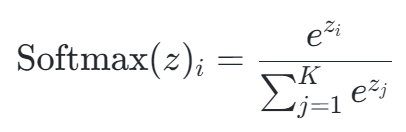

# Portfolio Optimization via Neural Networks

Aung Si 
October 17th, 2023

---

## Contents
- [1. Overview](#overview)
- [2. The Staticity of Mean Variance Optimization](#the-staticity-of-mean-variance-optimization)
- [3. Methodology & Data](#methodology--data)
    - [3.1. Feature Engineering](#31-feature-engineering)
    - [3.2. Sidestepping Price / Return Forecasting](#32-sidestepping-price--return-forecasting)
    - [3.3. Data Sources](#33-data-sources)
    - [3.4. Temporal Considerations](#34-temporal-considerations)
- [4. Modeling](#4-modeling)
7. Results
8. Conclusion
9. Limitations
10. Future Work
11. Repository Structure

## 1. Overview

*This endeavor draws substantive influence from the University of Oxford's [Deep Learning for Portfolio Optimization](https://arxiv.org/abs/2005.13665). However, the project diverges at crucial junctures in its execution.*

The original paper, written by Zihao Zhang, Stefan Zohren, and Stephen Roberts, introduces a novel approach to portfolio optimization by employing neural networks. Unlike traditional mean-variance methods, which are inherently static and rely on historical data, the paper's approach uses the Sharpe ratio as the objective function (maximized via gradient ascent) to adaptively optimize portfolio allocations. This creates a more dynamic, forward-looking model capable of adjusting to market conditions. While the authors tested various models such as FCN, CNN, and LSTM using a long-only strategy without leverage, my exploration included both with and without leverage approaches. The critical distinction lies in the application of sigmoid and softmax functions.

Another noteworthy divergence is in volatility scaling: while the authors applied it, I opted against its implementation for the sake of concision. Even so, I corroborated their conclusion that the LSTM model exhibited the most adaptability and consistently superior performance. Specifically, in my rendition, the leveraged LSTM model surpassed the VTI index by 152.4%, boasting an impressive Sharpe ratio of 1.12 versus VTI's 0.59 over a decade-long backtesting period. Conversely, the non-leveraged LSTM model yielded a 50.9% advantage over the VTI and recorded a Sharpe ratio of 1.09 against VTI's 0.59.

A salient characteristic of the sigmoid function, especially pertinent to my leveraged model, is its behavior. On certain dates, it results in leveraging, while on others, not all available capital is deployed. This variability speaks to the model's adaptability to market dynamics, optimizing capital utilization based on prevailing conditions.

Lastly, while the original paper furnished an architecture template, the exact model specifications were not touched upon. The task of defining the models, therefore, was undertaken independently, relying on the provided blueprint yet necessitating intricate detailing on my part.

All implementations of neural networks in this project were carried out with [`PyTorch`](https://pytorch.org).

## 2. The Staticity of Mean Variance Optimization

Traditional portfolio optimization has long been dominated by the [Mean Variance Optimization (MVO)](https://www.math.hkust.edu.hk/~maykwok/courses/ma362/07F/markowitz_JF.pdf) method, introduced by Harry Markowitz in 1952. While this method is grounded in elegant mathematics and provides a pragmatic foundation for portfolio selection, it exhibits notable shortcomings.

MVO hinges on the assumption that asset returns are normally distributed, and it primarily focuses on two parameters: expected returns and the covariance matrix of returns. By optimizing these, MVO determines the best possible asset allocation that will yield the highest expected return for a given level of risk.

However, the static nature of MVO emerges from its reliance on historical data to gauge future asset performances. By design, it takes a retrospective stance, relying on past return distributions to craft future portfolio allocations. This backward-looking approach intrinsically limits its adaptability to evolving market conditions and new information sets.

Moreover, the assumptions of MVO become especially questionable during tumultuous market periods. Black swan events, such as financial crises, can skew return distributions away from normality, leading to estimation errors in MVO's output. Additionally, the challenge of accurately estimating expected returns amplifies the potential pitfalls of the MVO. Often, slight changes in expected return estimations can result in substantially different portfolio compositions, creating inconsistency and unpredictability. MVO is also deterministic in its nature, which can lead to extreme portfolio weights. Without constraints, it might recommend full allocation to a singular asset if historical data suggests superior returns, disregarding diversification principles.

In light of these limitations, the quest for a more dynamic, adaptive, and forward-looking portfolio optimization technique becomes paramount. As the financial industry evolves, the inclusion of machine learning and neural networks offers a promising avenue to address the staticity inherent in MVO, laying the groundwork for the methodologies explored in subsequent sections of this study.

## 3. Methodology & Data

The methodology underpinning this study aligns closely with the framework presented in the original paper. Both our approaches center on the use of asset prices and returns as input features. I follow the below structure.

1. Retrieve market index data (VTI, DBC, AGG, and VIX) and compute logarithmic daily returns.
2. Conduct walk-forward portfolio optimization via neural networks (leveraged and non-leveraged).
3. Conduct a backtest for both scenarios, ***accounting for both transaction costs, borrowing costs, and principal ammortization***.
5. Examine allocations at specific timeframes (namely the COVID-19 pandemic) and overall adaptability of allocations with respect to the price trajectories of each index.
6. Examine the usage of leverage over time of each model.

While I maintain the core principles of the original paper, the key divergenceS lie in the dates I use for the data and in my usage of the sigmoid function, and which I will explore later.

### 3.1 Feature Engineering
The sole features employed are the asset prices and returns. This parsimony in feature selection helps mitigate the risk of overfitting, which may help to ensure the models remain robust and generalize well across different market conditions. However, the authors note the inherent potential for feature redundancy, given that returns are inherently derived from prices. Their inclusion hinges on their role in computing overall backtest returns. 

### 3.2 Sidestepping Price / Return Forecasting
While traditional methods often require a forecast of future returns or prices, this approach obviates that need. Given the inherent unpredictability, near-randomness, and self-correcting nature of the stock market, attempting to forecast returns frequently results in limited practical insights and can introduce unnecessary noise.

Instead, the innovation brought forth by the authors, and mirrored in this study, is the direct translation of this information into optimal portfolio weights. This is achieved using neural networks, specifically through the activation functions which are central to our model differentiation: **sigmoid** (where outputs range from 0 to 1) for leveraged models and **softmax** (where outputs range from 0 to 1 sum up to 1) for non-leveraged ones.

### 3.3 Data Sources
Both the original study and this research use the same four indices as primary data sources:

- **VTI**: A proxy for the overall stock market.
- **DBC**: Represents the commodities market.
- **AGG**: Captures the bond market dynamics.
- **VIX**: Provides insights into the overall market volatility.

Each of these indices is distinct and serves as an effective representative for different market characteristics, ensuring a multipronged view of the financial landscape. The authors' data range from 2006 - 2020, and their testing period is from 2011 - 2020, while the data I use range from 2006 - 2023, and the testing period I employ is from 2013 - 2023.

### 3.4 Temporal Considerations
Given that this study uses adjusted closing prices, there exists an inherent information lag. To account for this, the output allocations are lagged by a day, ensuring the methodology respects the chronological nature of information flow in financial markets.

## 4. Modeling
### 4.1 Leveraged vs Non-leveraged Scenarios
Before delving into the models, it's imperative to differentiate between leveraged and non-leveraged scenarios:

Leveraged Scenario: Allows borrowing of funds to amplify potential returns on an investment. However, while this offers the potential for magnified profits, it also brings an increased risk of losses.

Non-leveraged Scenario: The more orthodox investment approach, where no borrowing is involved. The potential for returns is directly tied to the initial investment amount, with no amplification. The risk is ostensibly lower compared to the leveraged scenario.

From an architectural perspective, the differentiation between these scenarios is encapsulated in the model's output layer. In a non-leveraged setting, a softmax layer ensures portfolio allocations sum to 1. In contrast, the leveraged scenario employs a sigmoid layer, offering a more flexible allocation scheme where both borrowed and invested funds can be modeled.

### 4.3 Activation Functions: Sigmoid vs Softmax
Understanding the mathematical properties of activation functions is paramount when discerning their suitability for specific tasks, particularly in portfolio management.

#### 4.3.1 Softmax

The Softmax function for a given vector $z$ is defined as:

    

Where $K$ is the number of classes (or assets in the context of portfolio allocation). The output is a probability distribution over K classes, meaning the sum of the outputs is exactly 1. This is suitable for non-leveraged portfolio allocations where the sum of asset allocations must equal the total investment.

The Softmax function ensures that an increase in the allocation of one asset leads to a corresponding decrease in the allocation of at least one other asset. This is coherent with the non-leveraged scenario, where any increase in one asset's allocation must be offset by reducing others to maintain the total investment constant.

#### 4.3.2 Sigmoid

$$\sigma(z) = \frac{1}{1 + e^{-z}}$$

The sigmoid function ranges between 0 and 1, and it effectively squashes its input into this interval. This makes it apt for representing probabilities or portfolio allocations when considering leveraged scenarios. A value close to 1 can represent a high allocation to a particular asset, while a value close to 0 can indicate minimal or no allocation.

However, the sigmoid function treats each output independently, meaning that the sum of the outputs is not constrained to be 1. In a leveraged scenario, this flexibility is advantageous, allowing the sum of allocations to be greater than the initial investment (representing borrowing) or less than the initial investment (indicating holding cash).

#### 4.3.3 Interpreting Probabilities as Portfolio Allocations:

The beauty of using these activation functions in portfolio management lies in their ability to transmute raw model outputs into interpretable portfolio allocations. Both sigmoid and softmax render outputs that align with the structure of probability distributions. Within the investment milieu, such probabilities are construed as the proportionate allocations of a portfolio to varying assets. For instance, should an asset procure a probability (or output) of 0.2 from the model, it signifies a recommendation that 20% of the portfolio be assigned to that particular asset. However, neural networks are domain agnostic and don't possess inherent financial cognizance. Its outputs, derived from patterns in the training data, are interpreted in this case by financial experts in the context of asset allocations. The network's main goal aligns with the training objective function (explored in section [4.4](#44-objective-function)), and the specific allocations are but a means to achieve that end. Thus, while the model might not fathom the intricacies of finance, its outputs, when correctly interpreted, can be seamlessly integrated into portfolio management.

### 4.3 Model Architectures, Inputs, Targets, and Outputs

Our feature set include 4 assets (number of indices) and 8 features (4 price series + 4 returns series), a lookback period of 50 days, and a total of 4403 samples (4453 data points - 50 day lookback period). All targets take the form $(4403,\text{ }4)$, representing the daily returns of each market index beyond the first 50 days.

1. **1D Convolutional Neural Network (CNN)**: This model deploys 1D convolutional layers for feature extraction. After the convolution, a dynamic fully connected layer transforms the output for portfolio allocations, which are then passed through a sigmoid activation function (for leverage) or a softmax activation function (no leverage) to ensure values between 0 and 1. `Pytorch`'s `Conv1d` takes an input shape of $(\text{num. samples, n. features, n. samples})$, so for our dataset it would have the shape $(4403,\text{ }8,\text{ }50)$.

2. **Fully Connected Neural Network (FCN)**: Being a more traditional architecture, it relies on two dense layers for processing. The final layer's outputs represent portfolio allocations, post sigmoid / softmax activation, ensuring values remain in the [0, 1] interval. I constructed the FCN via `PyTorch`'s `Linear` layers, which take inputs of size $(\text{num. samples}, \text{sequence length} \times \text{num. features})$, so for our dataset it would have the shape $(4403,\text{ }50 \times 8)$ or $(4403,\text{ }400)$.

3. **Long Short-Term Memory (LSTM)**: Leveraging the prowess of LSTM  units, this model is designed to recognize temporal patterns in data sequences. The LSTM layer processes sequences, and its outputs are directed to a fully connected layer. The final portfolio allocations, as in other leveraged models, are determined post a sigmoid / softmax activation. `PyTorch`'s `LSTM` class accepts an input of shape $(\text{num. samples, sequence length, num. features})$, so for our dataset it would have the shape $(4403,\text{ }50,\text{ }8)$.

The crux of the optimization problem resides in the above models' output layer, which output 4 allocation values (or portfolio weights), one for each asset. Feel free to peruse the [`no_leverage_models`](workflow/tools/no_leverage_models) and [`leverage_models`](workflow/tools/leverage_models) modules to see the source code for each model and its architecture.

### 4.4 Objective Function

The objective function used to train each model is the key innovation brought forth by the authors of the original paper. Instead of traditional loss functions such as Mean Squared Error (MSE) and the like, each model is trained to maximize the Sharpe ratio per trading period (1 day):

    

$$\text{where}$$
$$E[R_{p,t}] = \frac{1}{T} \sum^T_{t=1} R_{p,t}$$
$$\text{and}$$
$$R_{p,t} = \sum^{K}_{i=1}w_{i,t} \times R_{i,t}\quad\text{;}\quad K=4$$

$R_{p,t}$ is the return of the portfolio at time $t$, taken as the sum product of the allocation at time $t$ determined by the model of each asset $i$ and the asset's actual logarithmic return at time $t$. The expected portfolio return, ${E[R_{p,t}]}$ is taken as the mean of the returns within the batch.

By default, the models follow gradient descent, but we intend to maximize the Sharpe ratio via gradient *ascent*,

$$\theta_{\text{new}} = \theta_{\text{old}} + \frac{\partial{L_T}}{\partial{\theta}}$$

so in the code, the objective function is written to return a negative value.* View the [`metrics`](workflow/tools/metrics.py) module to see the implementation of the objective function in code.

**Note that `PyTorch`'s Adam optimizer now permits a `maximize` parameter so as to eliminate the need to create negative objective functions. However, for the sake of illustration I adhere to the default parameter.*

