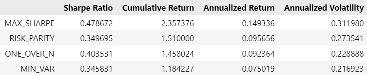
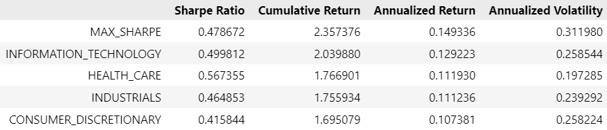
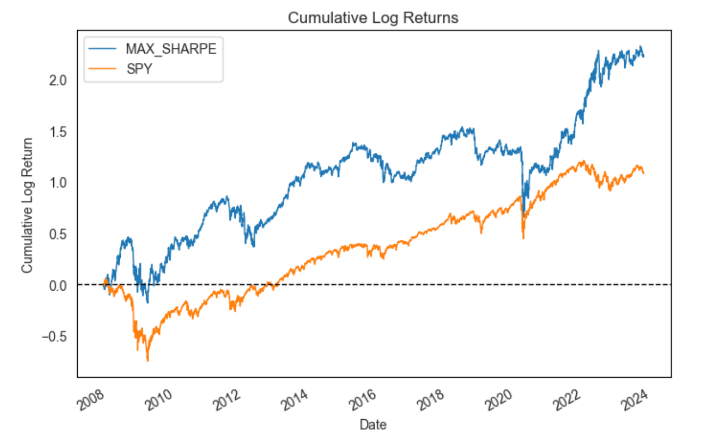

# Dynamic Portfolio Construction with Sector Rotation & Machine Learning

Aung Si 
September 9th, 2023

---

-  `#f03c15`

---

## Contents
- [Overview](#overview)
- [Business Understanding: Adaptive Sector Selection](#business-understanding-adaptive-sector-selection)
- [Methodology](#methodology)
- [Data](#data)
- [Feature & Target Engineering](#feature--target-engineering)
    - [Features](#features)
        - [Data Sources](#data-sources)
        - [Feature Transformation and Enhancement](#feature-transformation-and-enhancement)
        - [Statistical Tests](#statistical-tests)
        - [Dimensionality](#dimensionality)
    - [Targets](#targets)
        - [Sectoral Returns as Targets](#sectoral-returns-as-targets)
        - [Calculation](#calculation)
        - [Rationale](#rationale)
- [Modeling](#modeling)
    - [Asymmetric Loss Function](#asymmetric-loss-function)
    - [Models Used](#models-used)
        - [Regression Models](#regression-models)
        - [Time Series Models](#time-series-models)
    - [Model of Models](#model-of-models)
- [Mean Variance Optimization](#mean-variance-optimization)
    - [Maximum Sharpe Ratio](#maximum-sharpe-ratio)
    - [Minimum Variance](#minimum-variance)
    - [Risk Parity](#risk-parity)
- [Results](#results)
    - [Model Performance](#model-performance)
    - [Comparison with the Naïve Model](#comparison-with-the-naïve-model)
    - [Sector Selection](#sector-selection)
        - [Sectoral Clusters](#sectoral-clusters)
    - [Backtesting](#backtesting)
        - [Asset Allocation Strategies](#asset-allocation-strategies)
        - [Sector Performance (Top 4)](#sector-performance-top-4)
        - [S&P 500 Index](#sp-500-index)
        - [Summary](#summary)
- [Conclusion](#conclusion)
- [Limitations](#limitations)
    - [Data Constraints](#data-constraints)
    - [Modeling Caveats](#modeling-caveats)
    - [Optimization Limitations](#optimization-limitations)
    - [Practical Challenges](#practical-challenges)
    - [Analytical Limitations](#analytical-limitations)
- [Future Work](#future-work)

## Overview
In this project, I've engineered an adaptive machine learning algorithm that undergoes biannual recalibration to select the most accurate model for sector-based investment strategies. To counteract the pitfalls of over-forecasting, the algorithm employs a custom loss function that penalizes overpredictions. It comprehensively integrates a diverse range of financial indicators, including equity, debt, commodities, and market volatility. To enhance computational efficiency and model precision, I employed Principal Component Analysis for feature reduction. The model's robustness was substantiated through a 15-year backtest, during which it outperformed the SPY index by an estimated 91.85%. The finalized, vetted model has been encapsulated in a real-time dashboard.

## Business Understanding: Adaptive Sector Selection
The mercurial landscape of the financial markets warrent strategies that are dynamic and adapative, but even strategies like sector rotation often fall short due to their reliance on static heuristics. This project mitigates such limitations by employing a machine learning-driven "model of models" framework. This ensemble of algorithms undergoes biannual retraining and evaluation. The best-performing model is then selected for the next six-month cycle, ensuring the investment strategy continually adapts to current market conditions.

Once the leading model is identified, it selects the investment sector based on its predicted mean returns, specifically targeting the sector forecasted to yield the highest return. This dynamic, model-driven sector selection aims to optimize investment outcomes by leveraging timely and precise machine learning predictions.

The strategy is then tested via a 15-year backtest, offering empirical validation of its sector-based approach. Thus, the framework's utility manifests in its ability to not only adapt to market vicissitudes but also pinpoint the most promising sectors for investment based on forecasts.

## Methodology
1. **Data Retrieval** - Retrieve prices for stocks and indices via `yfinance`.
3. **Feature Engineering** - Engineered features capture essential market variables: log returns, Sharpe ratios, and lagged features. Each feature is validated for stationarity. PCA mitigates multicollinearity.
3. **Target Engineering** - Sectoral returns are the primary targets, calculated as average log returns within each GICS Sector, providing a sector-focused strategy.
4. **"Model of Models" Architecture** - Utilizes multiple machine learning models. Biannually, models are retrained and assessed. The top-performing model is chosen via a custom loss function penalizing overpredictions. The sector indicated by this model is the investment focus. A naïve model, which forecasts future returns based solely on the past six months of returns, is also included to serve as a rudimentary but necessary baseline for model comparison.
5. After sector selection, the asset allocation within the chosen sector is optimized using mean-variance optimization techniques, specifically Maximum Sharpe Ratio, Risk Parity, and Minimum Variance methods. These techniques are categorized under mean-variance optimization due to their focus on optimizing the risk-return profile of the portfolio. A naive $1/n$ portfolio, where all available assets are given equal allocations, was used a benchmark to ground the results of the optimization techniques employed.
6. **Backtesting** - The selected investment strategy is backtested, accounting for transaction costs, over a historical period to validate its efficacy. 

## Data
The initial data pool encompassed daily prices of all 503 constituents of the S&P 500 (the tickers for which were scraped from [Wikipedia](https://en.wikipedia.org/wiki/List_of_S%26P_500_companies)), along with four pivotal market indices: the Vanguard Total Stock Market Index Fund ETF (VTI), the 
Invesco DB Commodity Index Tracking Fund (DBC), the iShares Core US Aggregate Bond ETF (AGG), and the Chicago Board Options Exchange's CBOE Volatility Index (VIX) used as proxies for the prices of stocks, commodities, bonds, and volatility. All prices were fetched using the [`yfinance`](https://pypi.org/project/yfinance/) package. However, data gaps necessitated a refinement of this dataset and the analytical timeframe. Post-cleaning, the effective timeframe spanned from November 17, 2006, to September 11, 2023.

Further adjustment involved feature shifting to accommodate a 252-day forecast, equivalent to the number of trading days in a year. Consequently, the dataset's starting point for the model training was shifted to November 20, 2007. This maneuver ensured that the model's predictive variables align accurately with the forecast period, while still maintaining data integrity. This dataset provides a robust 16-year snapshot of market behavior, forming the bedrock for the machine learning framework.

## Feature & Target Engineering

### Features
The feature set is crafted to encapsulate diverse market indicators and sectoral insights. The following breaks the engineering process down:

#### Data Sources
- **S&P 500 Constituents**: 419 stocks with historical prices from February 6, 2006, to the present.
- **Market Indices**: Four key indices—Bonds, Commodities, Stocks, and Volatility—also spanning the same timeframe.
#### Feature Transformation and Enhancement
- **Log Returns**: Log returns were computed from prices to ensure stationarity of features.
- **Lookback Period**: A 10-day rolling window was used to calculate the Sharpe ratio for each feature, annualized with a factor of 252.
- **Lagged Features**: Created for each quarter (63 trading days) up to a year, capturing seasonality and longer-term trends.
#### Statistical Tests
- **ADF Test**: Augmented Dickey-Fuller test confirmed all features to be stationary, a prerequisite for time-series modeling.
#### Dimensionality
The final dataset comprises 120 features, tested for stationarity. Initially, a heatmap of feature correlations revealed significant concerns regarding multicollinearity:

    

However, this issue was mitigated using Principal Component Analysis (PCA) within the modeling pipelines.

The feature set aims to capture the snapshot of current market conditions and includes backward-looking indicators that help the machine learning models understand historical market behavior. Rolling computations were employed to preclude any data leakage from future observations, thereby maintaining the integrity of the predictive models.

### Targets
#### Sectoral Returns as Targets
The primary targets for this machine learning framework are the sectoral returns, which are calculated as the average log returns of the stocks within each GICS (Global Industry Classification Standard) Sector. These sectoral returns serve as the key performance indicators that the models aim to predict, thereby enabling a sector rotation strategy.

#### Calculation
- **Sector Identification**: Stocks are first categorized into their respective GICS Sectors.
- **Log Returns**: Following identification, stock prices are transformed into log returns.
- **Average Log Returns**: For each trading day, the average log returns of the stocks in each sector are computed to generate the sectoral returns.

#### Rationale
Sectoral returns offer an aggregated, yet nuanced, view of market trends. By focusing on sectoral returns as targets, the models can capture underlying economic factors affecting specific industries. This facilitates a more informed and targeted investment strategy, compared to using broader market indices and enables a strategy that can adapt to sector-specific trends and conditions.

## Modeling

### Asymmetric Loss Function

The 'Over-Under Error' loss function is specifically tailored for long-only investment strategies. In such strategies, investors can only buy and hold assets, making portfolios more susceptible to market downturns. Therefore, overpredictions in asset returns can lead to overexposure to certain assets, exacerbating potential losses. To mitigate this, the function is designed to penalize overpredictions more heavily. Mathematically, the loss is defined as:

$$\text{loss} = 
\begin{cases} 
\text{underpred penalty} \times \left| \text{residual} \right|^\alpha & \text{if residual} < 0 \\
\text{overpred penalty} \times \left| \text{residual} \right|^\alpha & \text{otherwise}
\end{cases}$$

The model is discouraged from making optimistic forecasts that could lead to overallocation of capital in risky assets.

### Models Used
The machine learning framework in this project comprises an ensemble of diverse models, each with distinct strengths tailored for financial market analysis. The models are preprocessed using Principal Component Analysis (PCA) to capture at least 80% of the variance in the data, and standard scaled for normalization. Below are the models and their configurations:

#### Regression Models
- **Elastic Net**: Combines L1 and L2 regularization, aiding in feature selection and handling multicollinearity.
    - Parameters: `alpha = 1` (strong regularization), `l1_ratio = 0.5` (balanced L1 and L2)
- **Support Vector (SVR)**: Uses an RBF kernel to capture non-linear relationships.
    - Parameters: `kernel = 'rbf'`, `c = 1` (moderate regularization), `gamma = 'auto'` (automatic kernal coefficient)
- **Random Forest**: An ensemble of decision trees, capturing complex relationships and feature importance.
    - Parameters: `n_estimators = 100`
- **Gradient Boosting**: Boosting algorithm suitable for capturing non-linear relationships.
    - Parameters: `n_estimators = 100`
- **Extreme Gradient Boosting**: Optimized gradient boosting algorithm known for speed and performance
    - Parameters: `n_estimators = 100`

All regression models are configured with `random_state = 42` for reproducibility. 

#### Time Series Models
- **Naïve**: Forecasts future returns based on the past six months of returns. Serves as a benchmark for performance.
- **ARIMAX**: Time series model that incorporates external variables to forecast future returns.

This ensemble enables the framework to adapt to a variety of market conditions, making it robust and versatile. The biannual recalibration process assesses the performance of these models, selecting the most effective one for the upcoming period.

### Model of Models
The framework employs a dynamic "Model of Models" architecture that re-trains each constituent model biannually, using data from the preceding six months. The model yielding the best Over-Under Error (OUE) score is selected as the lead model for the subsequent period. This chosen model identifies the most promising sector for investment based on the mean of its predicted returns. Stocks from the chosen sector are identified via their GICS segmentation. The resulting table is as such:

    

Following this, stock allocations are optimized based on mean-variance optimization methods, specifically the Maximum Sharpe Ratio, Risk Parity, and Minimum Variance optimizations. This cyclical recalibration ensures that the models and subsequently the investor's historical portfolio are updated with prevailing market conditions, optimizing both sector selection (via machine learning) and intra-sector asset allocation (via mean variance optimization).

## Mean-Variance Optimization

After the sector and its constituent stocks are identified through the "Model of Models" framework, the next step is to optimize the portfolio's asset allocation. This is accomplished using mean-variance optimization techniques, which aim to maximize returns while accounting for risk. Three specific optimization methods are therefore employed: Maximum Sharpe Ratio, Minimum Variance, and Risk Parity. Specifically, Maximum Sharpe Ratio optimizes for the best risk-adjusted return, Minimum Variance focuses on reducing portfolio volatility, and Risk Parity aims for equal risk contribution from each asset.

### Maximum Sharpe Ratio
The Maximum Sharpe Ratio method aims to find the portfolio allocation that maximizes the ratio of expected return to volatility. This is useful for helping investors achieve the highest return for a given level of risk. Mathematically, the Sharpe Ratio $S$ is defined as:

$$S = \frac{E[R_{p}] - R_{f}}{\sigma_{p}}$$

Where $E[R_{p}]$ is the expected portfolio return, $R_{f}$ is the risk-free rate, and $\sigma_{p}$ is the portfolio standard deviation. For simplicity, I've assumed $R_{f} = 0$, a negligible risk-free rate. The optimization problem is:

$$\text{Maximize } S \text{ subject to } \sum^n_{i=1}w_{i}=1$$

### Minimum Variance
The Minimum Variance method focuses solely on minimizing the portfolio's volatility. This is useful for risk-averse investors, who seek to assume the lowest possible risk profile in their portfolio. The optimization problem can be mathematically formulated as:

$$\text{Minimize } \sigma^2_{p} = w^{T}\Sigma{w} \text{ subject to } \sum^n_{i=1}w_{i} = 1$$

Where $w$ is the vector of the asset wieghts and $\Sigma$ is the covariance matrix of asset returns.

### Risk Parity
The risk parity method aims to allocate capital such that each asset contributes equally to the portfolio's overall risk. This is useful for investors who seek diversification across various risk sources. The optimization problem is to find weights $w$ that satisfy:

$$\text{Minimize }\sum^n_{i=1}
\Bigl(\frac{
    w \times \sigma_{i,p} - \text{Risk Parity Target}
}{\text{Risk Parity Target}}\Bigl)^2$$

Where $\sigma_{i,p}$ is the marginal contribution of asset $i$ to the portfolio risk, and the Risk Parity Target is $\frac{1}{n}$.

## Results

### Model Performance
Over the course of the biannual recalibrations, different models emerged as the preferred choice for sector selection.

- **Elastic Net**: Emerged as the most frequently selected model, chosen 13 times. It achieved an average Over-Under Error (OUE) of 0.092, indicating the best relative performance across diverse market phases.
- **ARIMAX**: Followed Elastic Net in preference, being selected 5 times. Despite fewer selections, it maintained a competitive average OUE of 0.101, confirming its efficacy in certain market conditions.
- **Extreme Gradient Boosting (XGB)**: Chosen on 3 occasions, it posted an average OUE of 0.098. While less frequently chosen, its performance metrics indicate that it's a viable alternative under specific circumstances.
- **Random Forest**: Also chosen on 3 occasions and achieved an average OUE of 0.093, underscoring its potential utility as part of the ensemble.

### Comparison with the Naïve Model
The naïve model outperformed all other models on May 28, 2020, as evidenced by its lowest OUE score of 0.151. In the context of this loss function, which penalizes overpredictions more heavily, the naïve model's superior performance suggests it made fewer and less severe overestimations on that specific date. This could be particularly valuable in a long-only investment strategy where overpredictions could lead to overexposure to risk. During this period, the market may have been in a state of equilibrium—a state of mean reversion—or following predictable cyclical trends, making the past a reliable predictor of the immediate future. 

That said, the model was selected as the best performer only once out of the 32 time frames. Given this sporadic performance, I deemed it too fickle for consistent inclusion in the ensemble and omitted it to focus on models that demonstrate more reliable performance across various market conditions. The Elastic Net model was chosen in its stead.

### Sector Selection

The biannual model recalibration also provides insights into sector preferences over time:

- Energy: 9 occurrences
- Information Technology: 5 occurrences
- Materials: 4 occurrences
- Consumer Discretionary: 3 occurrences
- Real Estate: 3 occurrences
- Health Care: 3 occurrences
- Financials: 2 occurrences
- Utilities: 2 occurrences
- Communication Services: 1 occurrence

#### Sectoral Clusters
What's interesting with the selection of sectors is that there's a proclivity for a chosen sector to be selected in the subsequent recalibration cycle. For instance, "Energy" was consecutively chosen multiple times, especially from 2021 through 2023. This could suggest the model's ability to identify and capitalize on enduring trends within particular sectors, which may speak to its temporal consistency.

### Backtesting

The backtesting phase spanned 16 years (from November 20th, 2007 to September 11th, 2023) and evaluated the portfolio's performance across four distinct asset allocation strategies: Maximum Sharpe Ratio, Risk Parity, Equal Weighting, and Minimum Variance. These strategies were compared against key market sectors and the S&P 500 index. 

#### Transaction Costs

Transaction costs were accounted for as per:

$$C_{i} = r \times \left|\Delta{w_{i}}\right|$$

Where $C_{i}$ is the transaction cost for the $i^{\text{th}}$ rebalancing period, $r$ is the cost rate, representing the proportion of the traded volume that is incurred as a transaction cost, and $\left|\Delta{w_{i}}\right|$ is the absolute change in asset weights between the $i^{\text{th}}$ and $(i-1)^{\text{th}}$ period. This approach allows for costs to adjust based on changes in portfolio allocation, capturing not only the shifts in asset weights but also scales them with a rate that reflects the transaction costs as a fraction of the traded volume.

#### Asset Allocation Strategies

    

- **Maximum Sharpe Ratio**: Showed the highest Sharpe ratio of 0.479 and an impressive cumulative return of 2.36 times the initial investment. The annualized return was 14.93%, although this came with higher annualized volatility at 31.20%.
- **Risk Parity**: Had a Sharpe ratio of 0.35 and a cumulative return of 1.51 times the initial investment, with an annualized return of 9.57% and a volatility of 27.35%.
- **Equal Weighting**: Achieved a Sharpe ratio of 0.404 and a cumulative return of 1.46 times the initial investment. The portfolio's annualized return was 9.24%, with a volatility of 22.89%.
- **Minimum Variance**: Recorded a Sharpe ratio of 0.346 and a cumulative return of 1.18 times the initial investment. It had an annualized return of 7.50% and a volatility of 21.69%.

#### Sector Performance (Top 4)

    

- **Technology**: This sector had a Sharpe ratio of 0.5 and a cumulative return of 2.04 times the initial investment, with an annualized return of 12.92%.
- **Healthcare**: Registered a Sharpe ratio of 0.567, a cumulative return of 1.77 times the initial investment, and an annualized return of 11.19%.
- **Industrials**: Had a Sharpe ratio of 0.465, a cumulative return of 1.76 times the initial investment, and an annualized return of 11.12%.
- **Consumer Discretionary**: Posted a Sharpe ratio of 0.416, a cumulative return of 1.70 times the initial investment, and an annualized return of 10.74%.

#### S&P 500 Index

    

    

The S&P 500 index had a Sharpe ratio of 0.444, a cumulative return of 1.44 times the initial investment, and an annualized return of 9.11%.

#### Summary
The Maximum Sharpe Ratio strategy outperformed all individual sectors and the S&P 500 index in terms of both Sharpe ratio and cumulative return. However, this performance came with heightened volatility. Among sectors, Healthcare led in Sharpe ratio but was second to Technology in cumulative and annualized returns. Overall, the asset allocation strategies, particularly Maximum Sharpe Ratio, demonstrated their effectiveness in maximizing portfolio returns over a 16-year period.

## Conclusion

This work combines machine learning and portfolio optimization to construct a dynamic asset management framework. The architecture, a "Model of Models," undergoes a biannual recalibration, ensuring the methodology remains responsive to changing market conditions. The custom asymmetric loss function, designed to penalize overestimations, adds a safeguard against overexposure to risk. This is particularly crucial for long-only investment strategies, where mitigating downside risk is essential.

In terms of asset allocation, the Maximum Sharpe Ratio strategy surfaced as the most effective in generating the highest risk-adjusted returns. Although this approach led to higher portfolio volatility, it outperformed all individual sectors and the broad market, as represented by the S&P 500. The model's repeated selection of specific sectors like Energy and Information Technology could indicate its ability to latch onto persistent market trends, potentially providing an edge in long-term investment.

Transaction costs, often neglected in theoretical models, were incorporated here, providing a more realistic performance assessment. The inclusion of these costs did not significantly hamper the model's ability to outperform the market benchmark over a 16-year backtest.

In summary, the project offers a dynamic, adaptable, and robust framework for sector-based portfolio management. It not only adjusts to market conditions but also provides a built-in mechanism for risk control. The empirical results suggest that this approach could serve as a compelling alternative to traditional investment strategies, offering both adaptability and performance.

## Limitations

### Data Constraints
The dataset, although expansive, has its limitations. One primary concern is the assumption of stationarity. While each feature was tested for this property, the very nature of financial markets implies that they can undergo fundamental changes, thereby violating the stationarity premise. The 16-year backtesting window also carries the risk of generalization, as it may encompass multiple market regimes, each with its unique characteristics. This polyregime environment could blur the lines of interpretability and generalizability, making it challenging to isolate the model's performance across distinct market conditions.

### Modeling Caveats
In the realm of machine learning models, several pitfalls need addressing. Despite efforts to regularize, the risk of overfitting to the training data remains, particularly given the complex, high-dimensional nature of financial markets. The biannual recalibration, while designed to keep the model up-to-date, may not be agile enough to adapt to sudden market shifts. The custom asymmetric loss function is designed to mitigate the risk of overpredictions, but it's not a foolproof mechanism. The "Model of Models" architecture, although robust, could inadvertently be biased toward models that excel in specific market conditions but underperform in others, thereby lacking in comprehensive adaptability.

### Optimization Limitations
The optimization techniques used in this framework also come with their set of limitations. For instance, a constant risk-free rate is assumed for simplification, but in reality, this rate is variable. The model is also designed for single-period optimization, which may not align with the investment horizon of a typical long-term investor. Moreover, strategies like Maximum Sharpe Ratio may suggest short positions, which are not feasible in a long-only portfolio, thereby limiting the strategy's practical applicability.

### Practical Challenges
On the practical front, the model assumes transaction costs based on a fixed rate, which may not accurately reflect real-world conditions where such costs can vary widely. Liquidity is another overlooked aspect; the model assumes that any volume of an asset can be transacted, which is often not the case in real markets. Furthermore, tax implications, which could significantly impact net returns, are not accounted for in this model.

### Analytical Limitations
Finally, the model leans heavily on the Sharpe ratio as a measure of risk-adjusted returns. While a useful metric, it's not the only lens through which to assess investment performance. Also, the model's results are sensitive to its initial conditions, meaning that different initial investments and asset allocations could yield disparate outcomes.

## Future Work

- **Enhanced Data Inclusion**: To augment the model's predictive accuracy, future iterations could integrate alternative data sources such as macroeconomic indicators, sentiment analysis from social media, or news articles. These could offer a more holistic view of market conditions.
- **Advanced Statistical Tests**: While the Augmented Dickey-Fuller test was employed to check for stationarity, additional tests like the Phillips-Perron or KPSS could be utilized for more robust stationarity verification. Furthermore, techniques like cointegration could be used to identify long-term relationships between variables.
- **Model Refinement**: Current models could be hyperparameter-tuned through grid search or random search. Moreover, the inclusion of more sophisticated models like Long Short-Term Memory (LSTM) networks or transformers could be explored, particularly for their ability to capture complex temporal patterns.
- **Dynamic Risk Management**: The present architecture uses a static custom loss function. Future versions could employ a dynamic loss function that adapts to varying market volatility, thereby enhancing the model's risk management capabilities.
- **Real-time Adaptation**: The current recalibration frequency is biannual. Implementing a more frequent, perhaps monthly, recalibration could make the model more responsive to sudden market shifts.
- **Multi-Period Optimization**: The existing optimization is single-period, aimed at maximizing returns over a fixed interval. Extending this to a multi-period framework could better align the model with the investment horizons of long-term investors.
- **Transaction Cost Models**: Presently, a fixed transaction cost rate is assumed. More realistic models accounting for varying transaction costs could be incorporated.
- **Tax Implications**: Future versions could include a tax-optimization layer to maximize post-tax returns, a critical aspect often overlooked in theoretical portfolio optimization.
- **Benchmarks and Comparisons**: Beyond the S&P 500, the model could be compared with other benchmarks or even with actively managed funds to better gauge its efficacy.
- **Sensitivity Analysis**: The model could undergo sensitivity analysis to assess its robustness against changes in initial conditions, such as different starting capital or alternative asset allocation strategies.

Addressing the above would significantly extend the model's applicability, robustness, and performance, making it a more compelling tool for dynamic portfolio management.